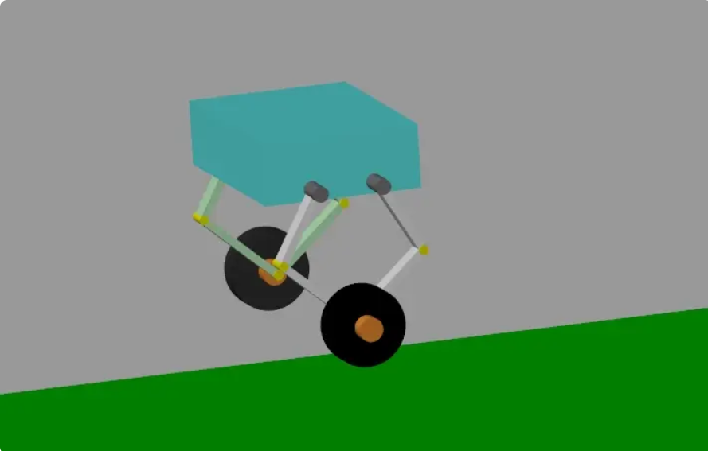
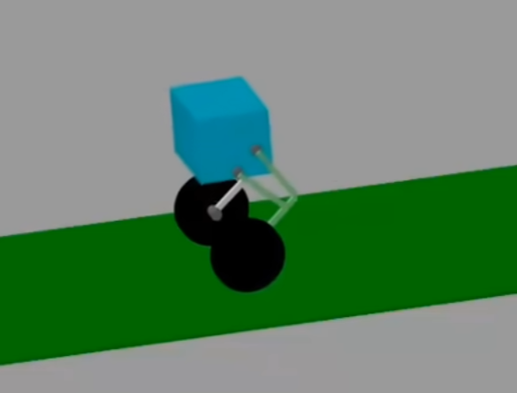

**存储五，二，四（ascento）连杆轮腿机器人MATLAB仿真的仓库，MATLAB最低版本不小于*2022b***

使用其中任意一个仿真时候，需要首先运行get_k函数，用以计算仿真所需全部参数

> [!NOTE]
>
> five-link 
>
> 

> [!NOTE]
>
> four-link
>
> 

> [!NOTE]
>
> two-link
>
> 

因本人没有精力继续开发，除去五连杆轮腿机器人项目精修之外，其余两项工程文件里面均含有在开发过程中产生的许多没有任何作用的文件。但这些文件不影响基础功能，且本人也不会继续维护。